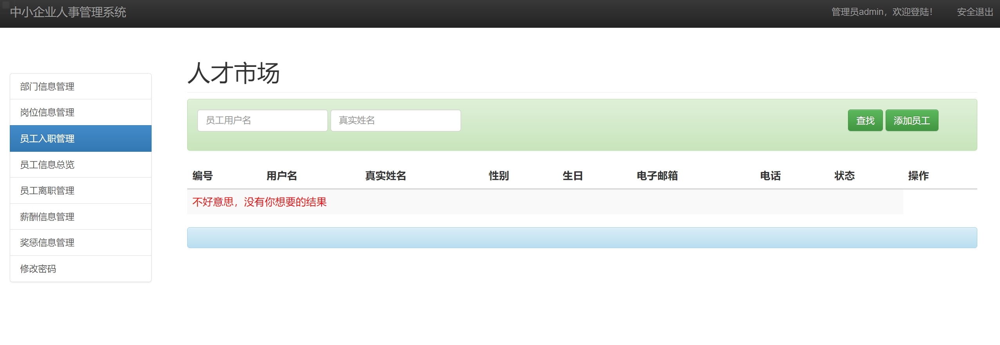

## 基于SSM框架的企业人事管理系统(程序+报告)

- <b>完整代码获取地址：从戎源码网 ([https://armycodes.com/](https://armycodes.com/))</b>
- <b>技术探讨、资料分享，请加QQ群：692619798</b> 
- <b>作者微信：19941326836  QQ：952045282</b> 
- <b>承接计算机毕业设计、Java毕业设计、Python毕业设计、深度学习、机器学习</b>
- <b>选题+开题报告+任务书+程序定制+安装调试+论文+答辩ppt 一条龙服务</b>
- <b>所有选题地址 ([https://github.com/YuLin-Coder/AllProjectCatalog](https://github.com/YuLin-Coder/AllProjectCatalog)) </b>

## 项目介绍
基于SSM框架的企业人事管理系统，有员工和管理员两个角色，主要功能如下

【用户员工端】
员工注册和登录
查看公司的部门信息
查看公司的岗位信息
查看公司同事信息
查看自己的薪酬信息
查看自己的奖惩信息
修改密码

【管理员端】
部门信息管理，添加，查询，修改，删除部门
岗位信息管理，添加，查询，修改，删除岗位
员工入职，添加员工信息
员工信息管理，查询，修改，员工岗位和权限
员工离职管理，查询员工离职信息
薪酬信息管理，可以添加，查询，删除，修改员工的薪酬信息，可以导入excel
奖惩信息管理，添加，修改，删除奖惩信息
修改密码

## 项目技术
- 编程语言：Java
- 数据库：MySQL
- 前端技术：JSP、JavaScript、Jquery、bootstrap
- 后端技术：Spring、SpringMVC、MyBatis

## 运行环境
- JDK版本：JDK1.8及以上
- 开发工具：IDEA、Ecplise、Myecplise都可以
- 数据库: MySQL5.7及以上

## 运行截图

